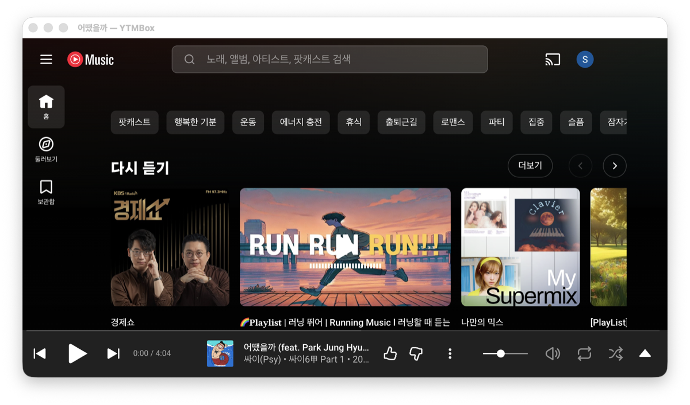

# YTMBox

*[한국어](README.md) · English*

A desktop wrapper around the YouTube Music web app for macOS (primary) and
Windows (secondary). No ad blocking, no downloading, no auto-update, no plugins,
no themes. It behaves exactly like the web app, with only the handful of things a
desktop app needs added on top.

- Google sign-in with a persistent session
- Remembers window size and position
- Keeps playing when the window is closed; restore from the tray or Dock
- Shows the current track in the menu bar (macOS)
- Hardware media keys and macOS Now Playing integration
- External links open in your default browser



> **This is an unofficial project.** YTMBox is not affiliated with Google LLC and
> is not endorsed, sponsored, or approved by Google. See [Notice](#notice).

## Install (macOS, Homebrew)

**Note:** the commands below only work once the `dalmooria/homebrew-tap`
repository exists and holds the cask. If the tap has not been created yet, use
"Install (macOS, direct DMG download)" below, or follow "Preparing the Homebrew
tap" first.

```sh
brew tap dalmooria/tap
brew install --cask ytmbox
```

(Homebrew prepends `homebrew-` automatically, so `brew tap dalmooria/tap` refers
to the `dalmooria/homebrew-tap` repository.)

This app is not signed with an Apple Developer certificate — it is ad-hoc signed.
The Homebrew cask strips the Gatekeeper quarantine attribute in its `postflight`
step, so installing this way needs no further action.

## Install (macOS, direct DMG download)

If you download the DMG from [Releases](https://github.com/dalmooria/ytmbox/releases)
and install it yourself, Gatekeeper will block it because the app is unsigned.
The symptom and the workaround differ by macOS version.

- **macOS 14 and earlier**: you get an "unidentified developer" warning. You can
  bypass it by **right-clicking YTMBox.app in Finder and choosing Open**.
- **macOS 15 and later**: you get "the app is damaged and can't be opened", and
  right-click Open does *not* bypass it. You have to remove the quarantine
  attribute yourself.

```sh
xattr -cr /Applications/YTMBox.app
```

Supported systems: macOS 13 Ventura or later (Apple Silicon / Intel), Windows 10
or later (secondary).

## Settings

Two options live under **설정 (Settings)** in the menu bar.

- **Spoof the Chrome User-Agent**: needed when Google sign-in rejects the app as
  an "insecure browser". On by default. Takes effect after a restart.
- **Force-grab media keys**: by default the app goes through the macOS Now
  Playing path. Turning this on intercepts media keys from other apps and
  requires Accessibility permission.

## Development

```sh
npm install
npm start        # build, then run
npm test         # vitest
npm run dist     # macOS DMG/ZIP → release/
npm run dist:win # Windows nsis installer → release/
```

## Releasing

1. Bump `version` in `package.json` and commit.
2. `git tag vX.Y.Z && git push --tags` → GitHub Actions builds and attaches the
   artifacts to the Release. The macOS builds (`dmg`/`zip`) and the Windows build
   (`exe`) run on separate runners.
3. `SHA256SUMS.txt` is produced only by the macOS job (`mac` in `release.yml`) and
   contains checksums for the macOS artifacts (dmg, zip) only. The Windows `.exe`
   is not included.
4. Copy the two zip hashes from the Release's `SHA256SUMS.txt` into the tap
   repository's `Casks/ytmbox.rb`, updating `version` and `sha256`.

### Preparing the Homebrew tap

`homebrew/ytmbox.rb` in this repository is a **template**, not a cask that
installs as-is. To distribute through Homebrew:

1. Create a separate GitHub repository named `dalmooria/homebrew-tap`.
2. Copy this repository's `homebrew/ytmbox.rb` to `Casks/ytmbox.rb` there.
3. Update `version` and both `sha256` values for every release and commit.

## Documentation

The documents below are written in Korean.

- [Development log](docs/development-log.md) — what was built and why, the defects
  that were fixed, and how things were verified
- [Release preparation](docs/release-checklist.md) — what is left before going
  public
- [Manual verification checklist](docs/superpowers/verification/2026-09-18-manual-checklist.md)

## Notice

YTMBox is an **unofficial**, third-party client built by an individual. It is
**not affiliated with, sponsored by, or endorsed by** Google LLC or its
affiliates, and it does not represent them in any way.

- "YouTube", "YouTube Music", and "Google" are trademarks of Google LLC. This
  project uses those names **only to describe which service it wraps**.
- This app is a shell that loads music.youtube.com as-is. It does not provide
  music or any other content of its own, and it does not store or redistribute
  any. All content is served by Google, and the **YouTube Terms of Service**
  apply in full.
- Ad blocking, downloading, and anything else that circumvents the terms of
  service are **deliberately not implemented**.
- The app icon and tray icon are original artwork that uses no Google trademark
  or logo.

This software is provided under the MIT License, **without warranty of any kind**.

## License

MIT. See `THIRD_PARTY_NOTICES.md` for third-party notices.

## Values to fill in before the first release

`REPLACE_WITH_ARM64_ZIP_SHA256` and `REPLACE_WITH_X64_ZIP_SHA256` in
`homebrew/ytmbox.rb` **cannot be known until the first release exists**. Copy the
two zip hashes from the `SHA256SUMS.txt` attached to the Release. Until then, the
cask will fail to install.
